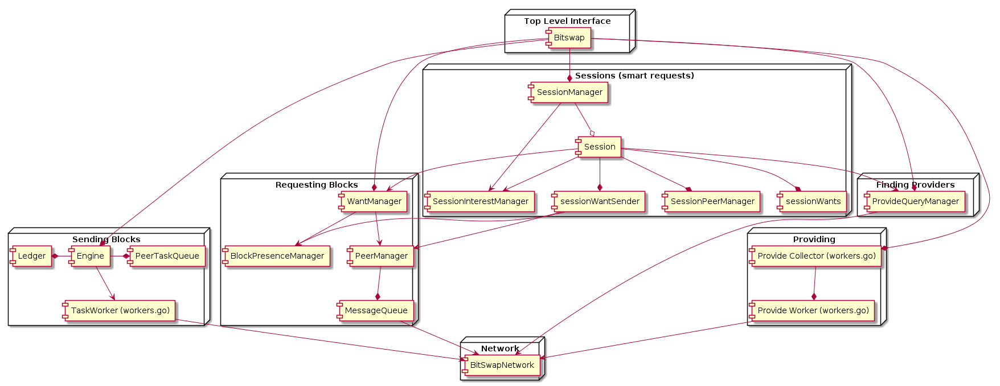

go-bitswap
==================

[](http://ipn.io)
[](http://ipfs.io/)
[](http://webchat.freenode.net/?channels=%23ipfs)
[](https://codecov.io/gh/ipfs/go-bitswap/branch/master)
[](https://circleci.com/gh/ipfs/go-bitswap)

> An implementation of the bitswap protocol in go!


## Table of Contents

- [Background](#background)
- [Install](#install)
- [Usage](#usage)
- [Implementation](#implementation)
- [Contribute](#contribute)
- [License](#license)


## Background

Bitswap is the data trading module for ipfs. It manages requesting and sending
blocks to and from other peers in the network. Bitswap has two main jobs:
- to acquire blocks requested by the client from the network
- to judiciously send blocks in its possession to other peers who want them

Bitswap is a message based protocol, as opposed to request-response. All messages
contain wantlists or blocks.

A node sends a wantlist to tell peers which blocks it wants. When a node receives
a wantlist it should check which blocks it has from the wantlist, and consider
sending the matching blocks to the requestor.

When a node receives blocks that it asked for, the node should send out a
notification called a 'Cancel' to tell its peers that the node no longer
wants those blocks.

`go-bitswap` provides an implementation of the Bitswap protocol in go.

## Install

`go-bitswap` requires Go >= 1.11 and can be installed using Go modules

## Usage

### Initializing a Bitswap Exchange

```golang
import (
  "context"
  bitswap "github.com/ipfs/go-bitswap"
  bsnet "github.com/ipfs/go-graphsync/network"
  blockstore "github.com/ipfs/go-ipfs-blockstore"
  "github.com/libp2p/go-libp2p-core/routing"
	"github.com/libp2p/go-libp2p-core/host"
)

var ctx context.Context
var host host.Host
var router routing.ContentRouting
var bstore blockstore.Blockstore

network := bsnet.NewFromIPFSHost(host, router)
exchange := bitswap.New(ctx, network, bstore)
```

Parameter Notes:

1. `ctx` is just the parent context for all of Bitswap
2. `network` is a network abstraction provided to Bitswap on top
of libp2p & content routing. 
3. `bstore` is an IPFS blockstore

### Get A Block Synchronously

```golang
var c cid.Cid
var ctx context.Context
var exchange bitswap.Bitswap

block, err := exchange.GetBlock(ctx, c)
```

Parameter Notes:

1. `ctx` is the context for this request, which can be cancelled to cancel the request
2. `c` is the content ID of the block you're requesting

### Get Several Blocks Asynchronously

```golang
var cids []cid.Cid
var ctx context.Context
var exchange bitswap.Bitswap

blockChannel, err := exchange.GetBlocks(ctx, cids)
```

Parameter Notes:

1. `ctx` is the context for this request, which can be cancelled to cancel the request
2. `cids` is an slice of content IDs for the blocks you're requesting

### Get Related Blocks Faster With Sessions

In IPFS, content blocks are often connected to each other through a MerkleDAG. If you know ahead of time that block requests are related, Bitswap can make several optimizations internally in how it requests those blocks in order to get them faster. Bitswap provides a mechanism called a Bitswap session to manage a series of block requests as part of a single higher level operation. You should initialize a bitswap session any time you intend to make a series of block requests that are related -- and whose responses are likely to come from the same peers.

```golang
var ctx context.Context
var cids []cids.cid
var exchange bitswap.Bitswap

session := exchange.NewSession(ctx)
blocksChannel, err := session.GetBlocks(ctx, cids)
// later
var relatedCids []cids.cid
relatedBlocksChannel, err := session.GetBlocks(ctx, relatedCids)
```

Note that new session returns an interface with a GetBlock and GetBlocks method that have the same signature as the overall Bitswap exchange.

### Tell bitswap a new block was added to the local datastore

```golang
var blk blocks.Block
var exchange bitswap.Bitswap

err := exchange.HasBlock(blk)
```

## Implementation

The following diagram outlines the major tasks Bitswap handles, and their consituent components:



### Sending Blocks

Internally, when a message with a wantlist is received, it is sent to the
decision engine to be considered. The decision engine checks the CID for
each block in the wantlist against local storage and creates a task for
each block it finds in the peer request queue. The peer request queue is
a priority queue that sorts available tasks by some metric. Currently,
that metric is very simple and aims to fairly address the tasks of each peer.
More advanced decision logic will be implemented in the future. Task workers
pull tasks to be done off of the queue, retrieve the block to be sent, and
send it off. The number of task workers is limited by a constant factor.

### Requesting Blocks

The want manager handles client requests for new blocks. The 'WantBlocks' method
is invoked for each block (or set of blocks) requested. The want manager ensures
that connected peers are notified of the new block that we want by sending the
new entries to a message queue for each peer. The message queue will loop while
there is work available and:
1. Ensure it has a connection to its peer
2. grab the message to be sent
3. Send the message
If new messages are added while the loop is in steps 1 or 3, the messages are
combined into one to avoid having to keep an actual queue and send multiple
messages. The same process occurs when the client receives a block and sends a
cancel message for it.

### Sessions

Sessions track related requests for blocks, and attempt to optimize transfer speed and reduce the number of duplicate blocks sent across the network. The basic optimization of sessions is to limit asks for blocks to the peers most likely to have that block and most likely to respond quickly. This is accomplished by tracking who responds to each block request, and how quickly they respond, and then optimizing future requests with that information. Sessions try to distribute requests amongst peers such that there is some duplication of data in the responses from different peers, for redundancy, but not too much.

### Finding Providers

When bitswap can't find a connected peer who already has the block it wants, it falls back to querying a content routing system (a DHT in IPFS's case) to try to locate a peer with the block.

Bitswap routes these requests through the ProviderQueryManager system, which rate-limits these requests and also deduplicates in-process requests.

### Providing

As a bitswap client receives blocks, by default it announces them on the provided content routing system (again, a DHT in most cases). This behaviour can be disabled by passing `bitswap.ProvideEnabled(false)` as a parameter when initializing Bitswap. IPFS currently has its own experimental provider system ([go-ipfs-provider](https://github.com/ipfs/go-ipfs-provider)) which will eventually replace Bitswap's system entirely.

## Contribute

PRs are welcome!

Small note: If editing the Readme, please conform to the [standard-readme](https://github.com/RichardLitt/standard-readme) specification.

## License

MIT © Juan Batiz-Benet
